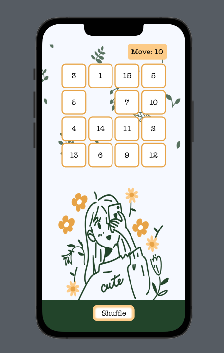
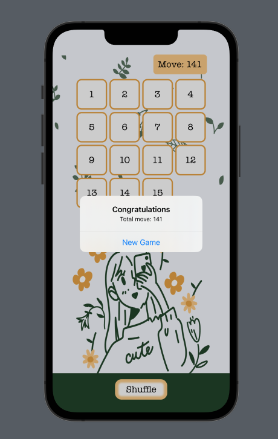

# Slide Number Puzzle Game

### ฟังก์ชันการทำงาน

- เกมจะทำการสุ่มลำดับตัวเลขของบล็อกจำนวน 4x4 บล็อก โดยมี 1 บล็อกเป็น free space\

- ผู้เล่นสามารถกดปุ่ม Shuffle เพื่อสุ่มลำดับตัวเลขใหม่ได้
- ผู้เล่นสามารถกดที่บล็อกรอบ free space เพื่อสไลด์บล็อกที่ต้องการไปยัง free space
-  โดยเกมจะนับจำนวน move ทุกการสไลด์บล็อกแต่ละครั้ง\

-  เมื่อผู้เล่นทำการเรียงตัวเลขสำเร็จ เกมจะจบลงโดยมี pop-up บอกจำนวน move ทั้งหมด และปุ่มเริ่มเกมใหม่\

   
Click [here](https://drive.google.com/file/d/1S9ZvX1F8HQ2TQVEIOrXdZrKpGkX0XQnp/view?usp=sharing) for clip demo.

**สุภาพันธ์ หง่อสกุล 6410615147**